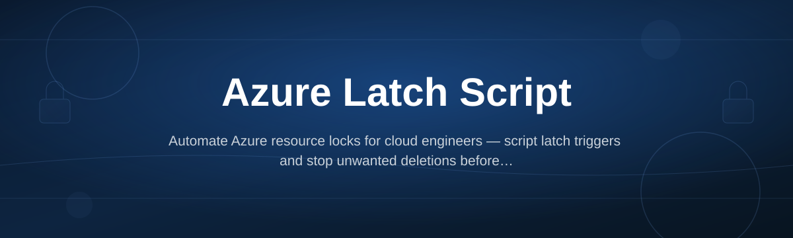
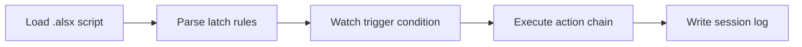

# azure-latch-script-engine

*A standalone Windows engine for running Azure Latch Script — no cloud account, no install wizard, no scripting toolchain.*

## What this is

Azure Latch Script (`.alsx`) is a small automation language built around one idea: actions fire when a **latch condition** — a state, a value, a signal — flips. Azure Latch Script Engine is the standalone Windows program that reads those `.alsx` files and runs them. You write the latch rule, the engine watches it, and executes the linked action the moment the condition trips.

The project exists for people automating repetitive Windows tasks who don't want a full scripting environment. There's nothing to compile and no dependency graph to manage — one executable reads your script and runs it.

Core pieces of every release:

1. **Latch parser** — reads `.alsx` files and validates trigger syntax before execution.
2. **Trigger watcher** — polls or listens for the condition defined in the script.
3. **Action runner** — fires the linked command chain once the latch closes.
4. **Session log** — writes a plain-text record of every trigger and action.

  

The button opens the project landing page, where the current build is available to download.

## Who it is for

- **Windows automation hobbyists** writing latch-triggered macros without a full IDE.
- **IT admins** scripting repetitive, condition-based desktop tasks.
- **QA testers** who need a lightweight trigger-and-log harness for repeated checks.
- **Script authors** distributing `.alsx` files to non-technical users.
- **Power users** replacing brittle keyboard-macro tools with condition-based logic.

## What you can do

1. **Run `.alsx` scripts directly** — double-click execution, no interpreter setup.
2. **Define multiple latch conditions** in one script, each with its own action chain.
3. **Chain sequential actions** so one trigger fires several steps in order.
4. **Read a plain-text session log** after every run for audit or debugging.
5. **Validate script syntax** before execution, with line-level error messages.
6. **Run in idle-watch mode** so the engine waits silently until a latch closes.
7. **Reuse scripts across machines** — the engine and script travel together, no install.
8. **Stop mid-run** with a single kill command, no orphaned processes.

## Getting started

1. Open the landing page via the download button above.
2. Download the current `azure-latch-script-engine` build for Windows.
3. Place the executable and your `.alsx` script in the same folder.
4. Run the executable — it loads the script and starts watching the latch.
5. Check the session log after the run to confirm trigger and action results.

## Requirements

| Item | Detail |
|---|---|
| OS | Windows 10 or Windows 11 (64-bit) |
| Install | None — standalone executable |
| Toolchain | None — no compiler, no runtime install |
| Disk | Under 50 MB |
| Network | Not required to run scripts |

## How it works

1. The engine loads your `.alsx` file and parses the latch rule block.
2. It validates syntax and reports line-level errors before doing anything else.
3. It watches the defined condition — a value, a file state, a signal.
4. When the latch closes, it runs the linked action chain in order.
5. Every trigger and action is appended to the session log.

## FAQ

**What is Azure Latch Script, exactly?**
It's a small `.alsx` scripting format where actions are tied to a latch condition instead of a fixed timer — the action fires when the